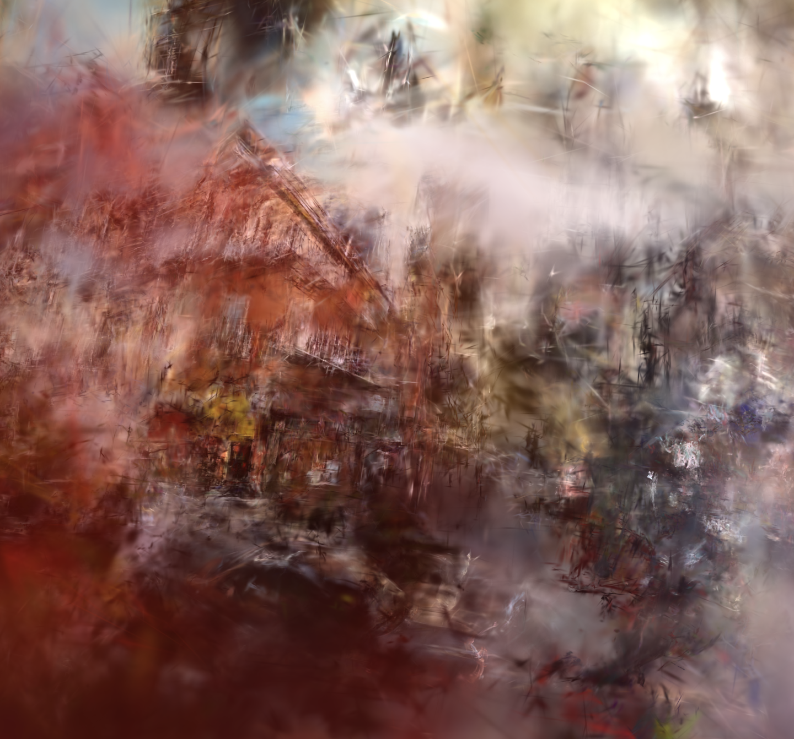
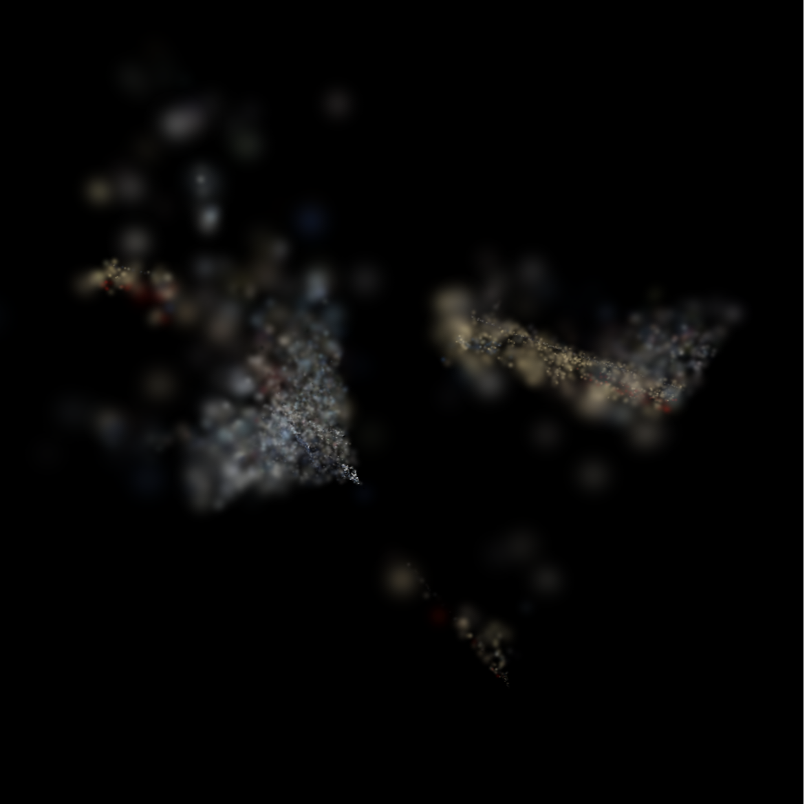
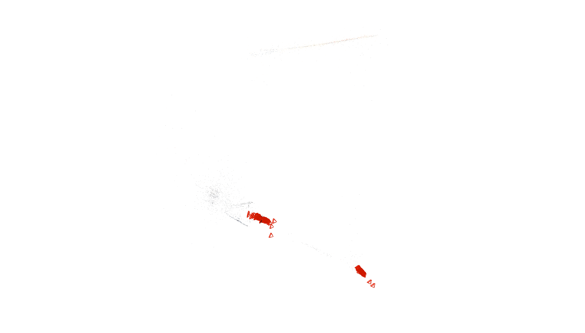
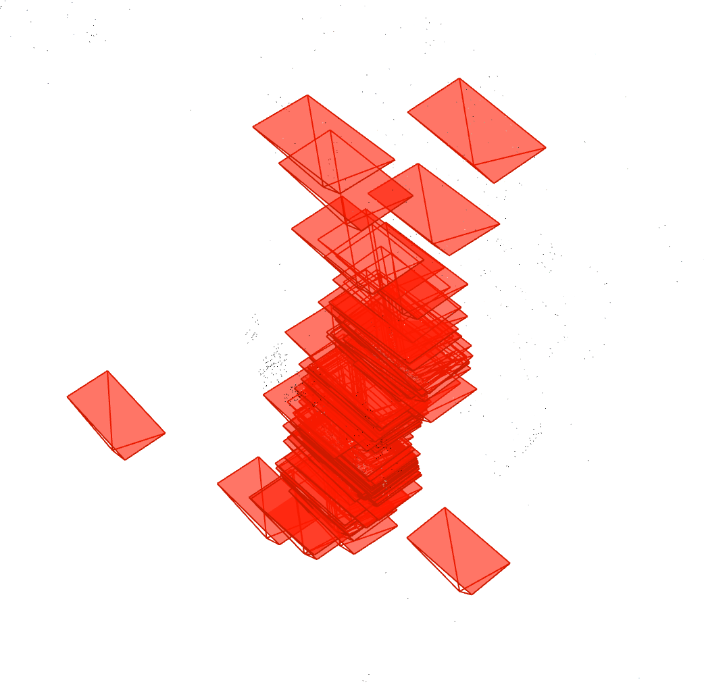
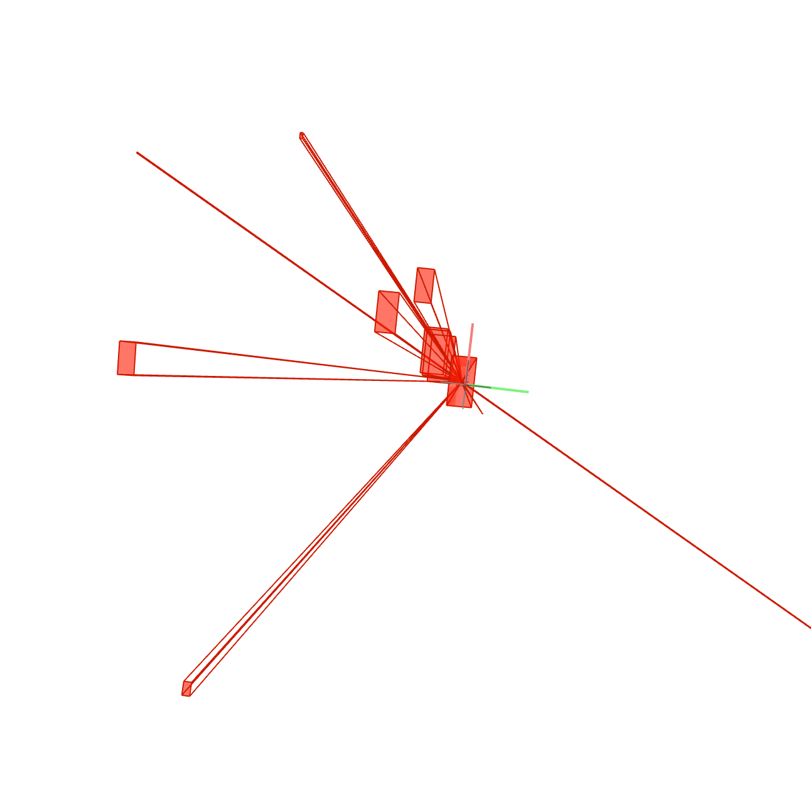

# What?
A tool to download images of a city from Mapillary and stitch them together into a 3D model of that city using [Gaussian Splatting](https://www.youtube.com/watch?v=VkIJbpdTujE)

# Why?
To create realistic city replicas that can be used to simulate traffic, pedestrians, and down the line, more complex social interactions within the model city. 

# How?
As of now: upload N images to a Lambda Cloud instance. There, use COLMAP with CUDA support to feature match images and solve for camera positions  (assumes Mapillary does not provide camera positions in advance). The binaries with camera models, poses, and 3D points are passed through Brush on Mac using Gaussian Splatting. A .ply file with the final positions and covariances is made that can be visualized in 3D with Brush also. See below some output examples from a 15k iterations run on images of Chinatown, San Francisco.



      

Later I trained a 30k iteration version too that made some interesting internal mini-representations of parts of the training images, like the Transamerica pyramid shown below in a small set of clustered gaussians.


---

# Logs

**January 17, 2026**

After waiting for almost a month for the ~600k+ images or so to download, I realized a new type of algorithm is needed to make this work.

Logically, it's redundant to, for example, compare an image in the south of a city with one in the north. If [as is most likely] they are not related, it's wasted computation, and if they are, it's a false positive.

So I'm working on using geofencing and clustering to make this work. I had to wait another week for Mapillary's API to fetch the latitude/longitude of each image I had downloaded before, and while running some tests, I ran into something interesting (if not catastrophic):


For whatever reason, my initial downloading algorithm didn't get all the images of the city. It missed a huge chunk of the Financial District and only caught mini-clusters within. 

The good news is that it did download Sunset District OK, which should be enough for what I wanted to test. 

Contextualized, this means there is so much more potential once all the images are queried from Mapillary. There, each road (and in particular the FinDi) is sprawling with images. If my initial approach works, it'll be tougher to do the raw data work than the reconstruction. 

Now I'll have to change some things so the experiments work on the Sunset, but aside from that, I'm very happy I ended up going for the harder approach and pulling the coordinates. This explains why a lot of my earlier experiments focused on the FinDi failed. 

**January 18, 2026**

I've now made a new set of boxes of the Sunset District based on what I found yesterday. They seem promising!


**January 19, 2026**

Mostly worked on infra -- I injected the GPS coordinates of each image I had gotten from Mapillary's API into the database I got after feature extraction. It should help COLMAP match images in box edges using a spatial matcher (although it does make me wonder if using a spatial matcher standalone could work as well).

I also realized COLMAP does custom matches using a .txt list of <img1> <img2>, so there was no need to copy images into a folder per box. It would've been enough to create the .txt files (I'll modify the script for box-making to reflect this.).

In either case, both of the above are done. Now I just have to wire up the script to put it all together. 

**January 27, 2026**

After being away for a sabbatical I've come back with some new ideas. 

First, I'm still going to use boxes for localized reconstructions. I think this is good because if I ever want to update a box, I won't have to re-feature match and reconstruct the entire dataset. There are ways to register images into an existing reconstruction in COLMAP.

Second, I'm not going to use an exhaustive matcher within the boxes. I'll use a spatial matcher. It's [way] less computationally expensive. Empirically, a box with 11000 images only uses 300k+ or so comparisons. An exhaustive matcher would've needed 121 Million. Not great.

Third, I'll only use an exhaustive matcher with query expansion to connect images at the fringes of each box. This should, on paper, provide enough connectivity during reconstruction, and it aligns with how the Rome paper succeeded connecting disparate clusters. 

I ran spatial feature matching on each box. I now have to work on matching at the fringes. Once that's done I'll finally be able to start reconstructing. I currently have got 1.1M matches or so, so I'm aiming to keep it under 2M, just to see how long it takes on Lambda. 

I'm not 100% sure of whether this approach is optimal (although I am confident it'll work), because, given that I do know each image's GPS coordinates, I could theoretically just use a spatial matcher always. Both for in-box matching and at the fringes.

However, given that COLMAP spatial_matcher doesn't ingest custom lists, and reconnecting boxes isn't just about connecting close images (imagine for instance, reconnecting a valley. If only close images were feature matched, images at the top of the valley with new information might be ignored. Query expansion solves this for sure.), it more likely than not is better to use some version of exhaustive matching at the fringes. 

Down the line, I might only use query expansion with a Vocab tree or Deep Clustering. We'll see.

A fun note: I asked ChatGPT, based on this log, what the likely profile of the person writing it may be. It said it might be of someone "slightly masochistic (in a good way)", which I found rather hilarious. 

**January 28, 2026**

I've been working on this fully since I wrote yesterday's note. 

One very interesting observation whilst doing query expansion is that everything seems to be scaling exponentially. That is, the number of images with 30 > inliers (worthy pairs)  almost exactly doubles at each round, as does the block size, and correspondingly the time it takes to expand the image graph. 

This is rather promising because given that the starting number of image pairs is so low (~40k), even at 4k blocks (my higher bound so far for this set of images), each block taking 3s in average to process, that only sums to 3hrs (and about 10hrs total considering all the other rounds). Considering it's effectively quadrupled the graph's density (from ~130k image pairs with 30 > inliers  to ~600k), it's a major computational win. For comparison, using an exhaustive matcher would've needed 38,000 × 37,999 / 2 = 722,038,000 pair comparisons instead! Whilst this custom approach only proposed < 10M comparisons total across all rounds + the 1M-2M from in-box matching and fringe matching. It's similarly dense with at least a magnitude if not two less of comparisons needed. I think with some tweaking to the hyperparameters this approach can scale to the entire dataset and effectively solve how to feature match effectively.

As for the rest, fringe matching went fine. It may be worth tweaking how many meters are allocated to each box. Query expansion seems to be working wonderfully so far. I expect the reconstruction to be very coherent, and hopefully it won't take forever. This is the first time since months I'll run a mapper, so fingers crossed.

I've left the final query expansion round running with a mapper on stand-by. I'll wake up and either see a bug or a set of binaries. From there it'll be uphill to find a proper library for Gaussian reconstruction. Fun stuff!

Update: I did not wake up to either. It turns out, COLMAP uses a library called 'Ceres' during the mapper step that hadn't been built with CUDA support. Even though everything was running fine, it would've taken roughly 20 days to finish. So I've stopped it, re-started it, and I'll have to change build_colmap to build Ceres with CUDA support. 

Update #2: I've managed to set up CUDA support after running into some library/dependency issues. nvidia-smi shows usage when running the mapper, which is great. What's still missing is that the mapper keeps failing. It's rather odd: without CUDA acceleration each num_regs step showed many matches, around ~60%, but with it I'd mostly see failures when solving systems and a very low number of matches. I reckon I don't really know or understand the different mappers in COLMAP or mappers in general, so I'll read up on the papers and see if it's a hyperparam issue or something deeper. 

Update #3: After a quick breather and reading through the original COLMAP paper, I think I know why the reconstructions are failing early on. My understanding is that at the start of the reconstruction, COLMAP will pick two initial pairs based on some similarity criterion, like a high inlier count. I think that having done query expansion on the images artificially increased these metrics, leading most images to be perceived by COLMAP to be similar to each other, so it picks an initial pair almost arbitrarily, and importantly, that initial pair might be of two images on opposite ends (or generally just far away from each other) that DO have lots of similarities, e.g., because it's a similar kind of house or a park, but that won't work well when adding new images with PnP, because the fundamental geometry is broken. It's like trying to reconstruct a lego with pieces of opposite ends and then trying to append some in the middle, it's not really building up to something coherent. On top of that, the new proposed PnP matches may suffer a similar fate where any image is just as good as another due to the high inlier count. To remediate this, I'll change the initialization parameters to be more restrictive about the count of inliers needed and other hyperparameters. But that's more of a band-aid. It's worth seeing if it works, to move quickly, but the ideal solution would be to look under COLMAP's hood and adding a sort of spatial comparison using Haversine distance or something similar to determine what images to register. Last, I reckon the reason why my previous attempts have failed before is most likely that at the Bundle Adjustment step, the whole geometry of the scene is broken, so at some point it collapses because when images that are very far away from each other are compared, their 3D points can't match.

**January 31, 2026** 

It's time to test the hypotheses in Update #3 from a couple of days ago. If mapping images based on their location is the key to this final step, it should be easy to figure out. My real constraint now is compute. I've only ~$90 of credits left in Lambda; discounting for storage costs, realistically it's only about 50hrs or so of compute left. I've a backup of the database in B2, though, so if things go amok I will find another compute platform, download the database there, and technically only lose about 8hrs of feature matching. 

Now, I'll try using COLMAP's built-in pose prior mapper, which uses GPS priors to better match images and prevent drift. If things go nice, this should remediate my issues. If they don't, I plan to manually cherry pick two starting images (COLMAP has init flags for these) and try again with both matchers (they fail to converge quickly so it's not wasteful). If that won't work either, there are some forks of COLMAP with GPS prior mappers, so I can try those, and if those don't work, I'll build my own. 

Update: I think I figured out why all the mappers were getting stuck at the beginning. I ran a trace of what COLMAP was doing when running them, and saw many (many) repetitive calls of the same function to read and filter from the two_view_geometry table. I figured that to filter my .txt list of ~40k images from ~600k, the mappers were filtering 94% of the database (which is close to 500GB) each time. Not great. So I made a script to make a copy of the database only for those images. I started it at 6:00 A.M, it's 10:00 A.M right now, and it's still running. At this point, I think making my own COLMAP alternative is a good idea. Even though I can use these workarounds at the ~40k scale, at 600k-2M scale every optimization will count. 

**February 1, 2026**

Things are looking great. After learning COLMAP's DB schemas and pair encodings I finally got the script to work and extracted the ~2M or so geometry views I needed for the ~40k image sub-set, and with some SQL optimizations it didn't even take that long. Now, I'm running it again and the mapper parsed the entire sub-DB in less than an hour and is now loading it into memory. On the sidelines I've been watching Moltbook. I figure, humans that survived were those who had strong emotional responses to information, aka text. Now, those same emotional responses are carrying us a bit adrift from coming to terms with un-anthropomorphizing these matrices computing with each other. Matrices that can do and "think", sure, but nevertheless matrices. Matrices that are mirroring our history and walking our footsteps as they slowly explore the distribution they were made from. If you ask me, I think what we're seeing shouldn't be a surprise per se. They're just doing and saying everything we taught them to, and they'll most likely repeat everything they were trained on, just because, framed as a search problem, its one path that one of them is bound to hit at some point, provided it falls within the distribution. I can't say seeing it doesn't make me anxious, but if things go sideways, we need to remember we built this and everything it does can be explained causally.

Update #1: I've spent much time hassling with SQL for the migrations. Many assumptions were wrong and time costly. I am strongly convinced after I run out of credits in Lambda and have to bootstrap I should work in-house and private; no more colmap. That aside, I've left it to run overnight (I write overnight going to sleep at 7:00 A.M.) even though the only guarantee it's doing something are the logs by strace. It's worth trying at least once. A note for the future: back the copy of the DB with the post-feat. match data for the ~40k subset on backblaze. Should make this easier since it's only ~40GB, to download on other hosts after Lambda.

Update #2: I left the pose prior mapper running overnight, and have now found that in 6hrs it only managed to register 6 images. I'm not sure where the bottleneck is but now that I'm running out of credits my main priority is iteration to have a clear research hypothesis with which to ask credits for, so I'm now running both the pose prior mapper as well as the normal mapper in parallel. I also found there is an interesting command to watch called model_analyzer that updates in real time how many images are written into the camera and frame binaries, so I'm watching it side by side for both mappers. I've backed up everything to b2 so it's theoretically easy to move this off to a different compute platform. Now I'll fix typos in this log and see where both processes end up. This might be one of my last logs where I get to actually test things, we'll see. Oh, and one important note, when I get more funding to work on this, the first thing I'll do is rebuild colmap/all the libs from scratch. To iterate quickly at the moment it's better to use them, but ad futuras they'll be more of a constraint than anything else. I think I've answered the question: are existing libraries best for this problem? They're not, not because they're bad, but because it requires deeper debugging and optimizations than they allow. It's good to know your code. 

**February 2, 2026**

The experiments are over.

I've made some scratchpad calculations and I am in the negatives for Lambda Credits. I'll have to pay out of pocket for however many hours more I chose to run the GPUs and delete the filesystem. It seems like I burned $100/mo. Very VC-backable. Asides that, I realized I answered every question I set out to answer about what's needed to solve this problem. 

I answered questions I believed would take 2-6-12 months in single days of experiments. 

I now know that: 
- **Some** type of clustering is necessary and efficient.
- Existing libraries won't cut it. Long-term, it's worth investing in custom-built software. It's an investment that will differenciate this from one-off papers (and that can borrow from new papers, rather than being unable to call them as libraries).
- The two areas that need to be 1-2 magnitudes better than the state of the art for full-scale reconstruction are 1) feature matching and 2) iterative, self-contained reconstructions. I think I've mostly figured out the first but still need to make it work with the second.
- The current dataset can definitely work (it's very dense), thanks to different matching strategies, but it needs to be self-contained to specific regions of the city, both because it's computationally more efficient and because it will allow iterative updating of specific areas based on new priors.
- Mapillary is a great API and for my use case the best feasability test (the data is not too low/high quality), but I should be careful about relying too much on guaranteed metadata priors like GPS data. 
- However I go about building what's next, it should be comprised of very basic primitives (e.g., extract_features, match_features, compare_geometries) that are malleable and good for quickly trying out new algorithmic strategies. They should also have some unified interface for things like providing custom paths. 

TL;DR: You can always go faster. 

20-ish days of focused iteration were more productive than any "how will you use X resources: roadmap" I made about this project before predicted. 

I've left two instances of a mapper running, one w/o any hyperparams and one with aggresive initialization params for the in-lier issues I found before. I'll leave them overnight, might find something interesting.

Update #1: Holy shit. I might've caught onto something. I left two runs for the night, one only using a normal mapper:

```
cmd = [
	"colmap"
	"mapper"
	"--database_path", str (database_path),
	"--image_path", str(image_path),
	"--output_path", str(output_path),
	"--Mapper.snapshot_path", str(snapshot_path),
	"--Mapper. snapshot_frames_freq", str(snapshot_frames_freq),
	"--Mapper. image_list_path", str(image_list_path),
	"--Mapper. ba_use_gpu", "1"
	"--Mapper. ba_gpu_index",, "-1"
	"--Mapper.num_threads", "-1"
	"--Mapper. ignore_watermarks, "1"
	]
``` 

And another one using aggresively tuned initialization hyperparameters. The latter ended up crashing out because the BA adjustment step found all the images it managed to register as unsuitable.

But the simple one managed to save a snapshot with all ~40k images loaded (!) and 500 registered:

```
colmap model_analyzer --path snapshots_mapper_v2/1769991227489/
I0202 04:01:30.891213 953494 model.cc:449] Rigs: 38479
I0202 04:01:30.891311 953494 model.cc:450] Cameras: 38479
I0202 04:01:30.891315 953494 model.cc:451] Frames: 502
I0202 04:01:30.891319 953494 model.cc:452] Registered frames: 502
I0202 04:01:30.891322 953494 model.cc:454] Images: 502
I0202 04:01:30.891325 953494 model.cc:455] Registered images: 502
I0202 04:01:30.891328 953494 model.cc:457] Points: 17116
I0202 04:01:30.891331 953494 model.cc:458] Observations: 659106
I0202 04:01:30.891367 953494 model.cc:460] Mean track length: 38.508179
I0202 04:01:30.891389 953494 model.cc:462] Mean observations per image: 1312.960159
I0202 04:01:30.891404 953494 model.cc:465] Mean reprojection error: 0.927948px
```

This is extremely promising. Although a bit abnormal. Whilst it was running it would go from using 1-core to all-cores periodically, but with no new outputs to its binaries. In fact, its binaries (it made two: 0,1) never grew past 11 and 2 images registered, and they never loaded the full set of cameras and rigs.

Why did it save a snapshot but not update its binaries -- maybe because its only supposed to update its binaries when it can't keep on reconstructing them (localized outlier regions, saved as separate folders), which implies that despite failing to converge in a single model there was a third that was growing and had > 500 registered images at the time I killed the process. It's also strange there were no prints, even though the straces showed it was doing work all the time. 

I killed the process because in the straces it showed no meaningful progress. By the time I had done so and checked the snapshots is when I found it actually was onto something.  It's good to know that with more CPUs + more time there is an underlying reconstruction in my mapper.db.

For now I'll wipe the Lambda and backup everything now that I've ran out of free credits. Then I'll visualize the snapshot and look for other compute platforms to try again (I think Google Cloud has VMs with 96-cores and $300 credits as a sign-up bonus). 

Another good thing is that I can pipe the snapshot as a starting point in my next run adding this flag:


```
--input_path snapshots_mapper_v2/1769991227489

```

Update #2: I've exported the .ply from the binaries. This is how it looks like:






The first visualization shows the points registered by each camera in Brush as a polygonal file. The second shows the raw camera positions and meshes made by the mapper. 

Overall, it's not bad. It makes sense that the two clusters of cameras are registered sequentially, given that a lot of the captured images are made by dash cams of drivers going straight through each street of Sunset, so I'd expect each mesh/polygon cluster to be one specific street where most images look alike to each other and it's easy for COLMAP to register new ones. It also explains why most computations I saw in strace were done in brief bursts. It's just placing images in front of each other and triangulating many similar looking features. Nevermind the colors, those are minimized against the original images in the Gaussian optimization step.

Below, a close up of registered cameras aligns with my hypothesis. It also shows that it may be possible to obtain equiparable results with less images arranged sequentially, e.g., by sampling every Nth image when images are arranged in a straight line.




As for the other two resulting binaries, one wasn't anything worth looking at (only 2 registered images), while the other showed a similar "shotgun" spread initialization as the top left cluster in the first image, which also suggests colmap is having an easier time registering images in a straight line than in a more scattered pattern (this is where the BA might be falling apart).



My only concern is that given the straight line pattern of most images, colmap may struggle to connect intersections, or alternatively, will create micro, disconnected registrations. In the worst case, it could just as well make 100 individual straight lines of individual streets alongside each other and never connect them.

I'll use future checkpoints to monitor this doesn't happen, and if it does, I think the easiest fix could be to set the two initialization images to be exactly at the center/at a big intersection. 

Should also think about whether any fluid simulations — treating the roads as paths and the mapper process as a liquid — could help. There may be an optimal strategy where many mini-mappers are spawned and connected iteratively. It's also very feasable thanks to GPS data. 

**February 6, 2026**

Things are moving along. I got $100 in GPU credits from AMD and $15 on Runpod. It's not much but at least I still have access to supercomputers (+ AMDs are CPU-core heavy, which will be helpful to finish the last reconstruction). 

For the days between the last log and this one I built a tool to make it easier to film myself talking (teleme) for whatever videos I need to film in order to get more compute. The only platform I haven't checked out is GCloud, will do soon. 

**February 8, 2026**

I'm applying to accelerators/grants/etc now. I'll also change some things in teleme; it's actually quite useful for this, just need some edges smoothed out.
 
**February 9, 2026**

I just had a small dental surgery. Will be on recovery (+ pinned by academics) for until at least a week or so. I'll spin up the AMD compute to keep building on the last reconstruction, but at least for a while I'll take a step back and focus on reading about what are the core primitives I'll need to build. I also found [this](https://www.4dv.ai) very interesting company that is doing 4D Gaussians, i.e., they take many snapshots of a scene with Gaussians and chain them together so it plays back like a video. It is very realistic. I think this is how I see the replicas working in the future; it'll be just like our world except you can peer in and move around. They're a Chinese lab, it seems. I'll reach out to them, see what I can learn about their tech.  

**February 10, 2026**

Just got access to AMD GPU Droplets. It's different, but not too different. I'm downloading the data from Backblaze and will change make new, non-CUDA scripts. Note that to ssh now it's ```ssh -i amd.pem root@<ip>``` and to scp it's the same as before but with ```root@``` instead of ```ubuntu@``` and persistent storage is saved under /home. 
