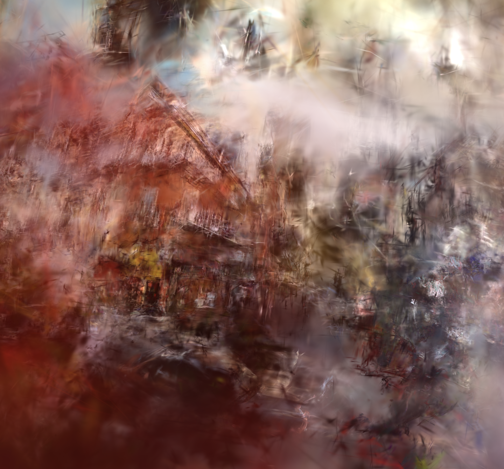
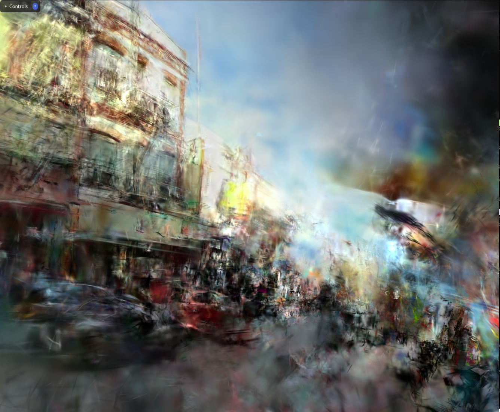
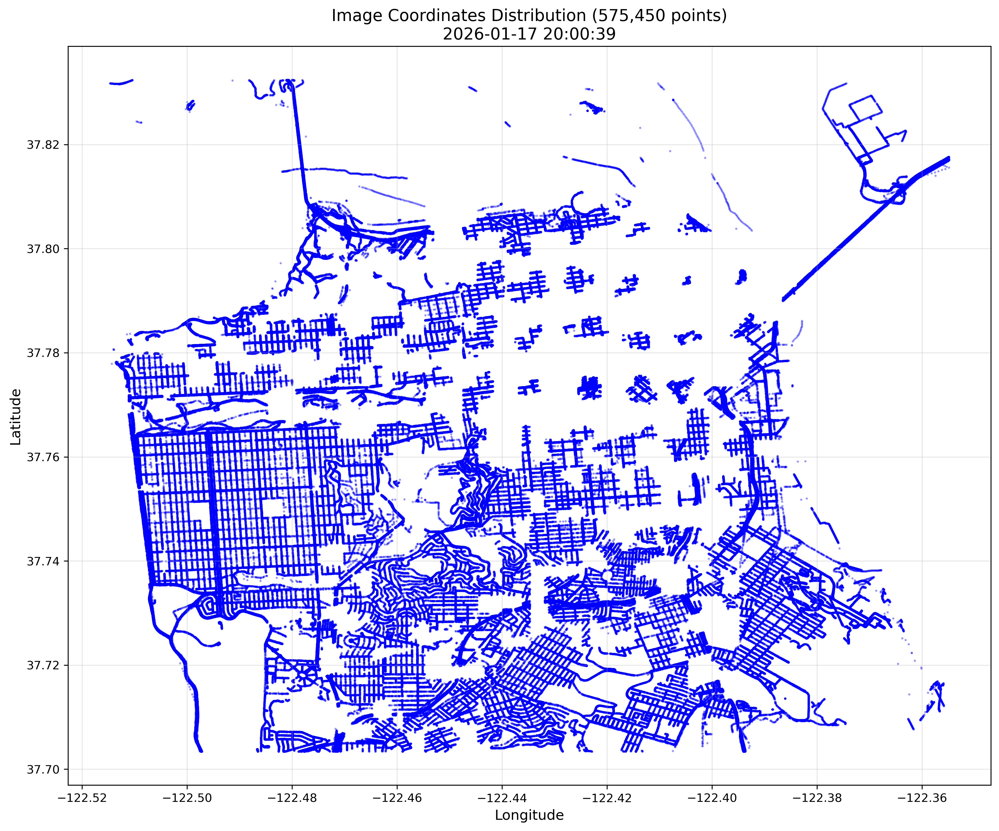
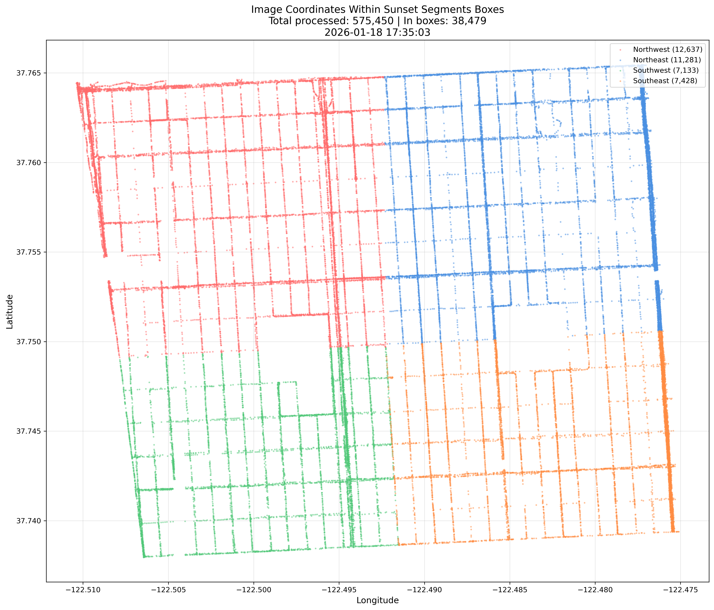
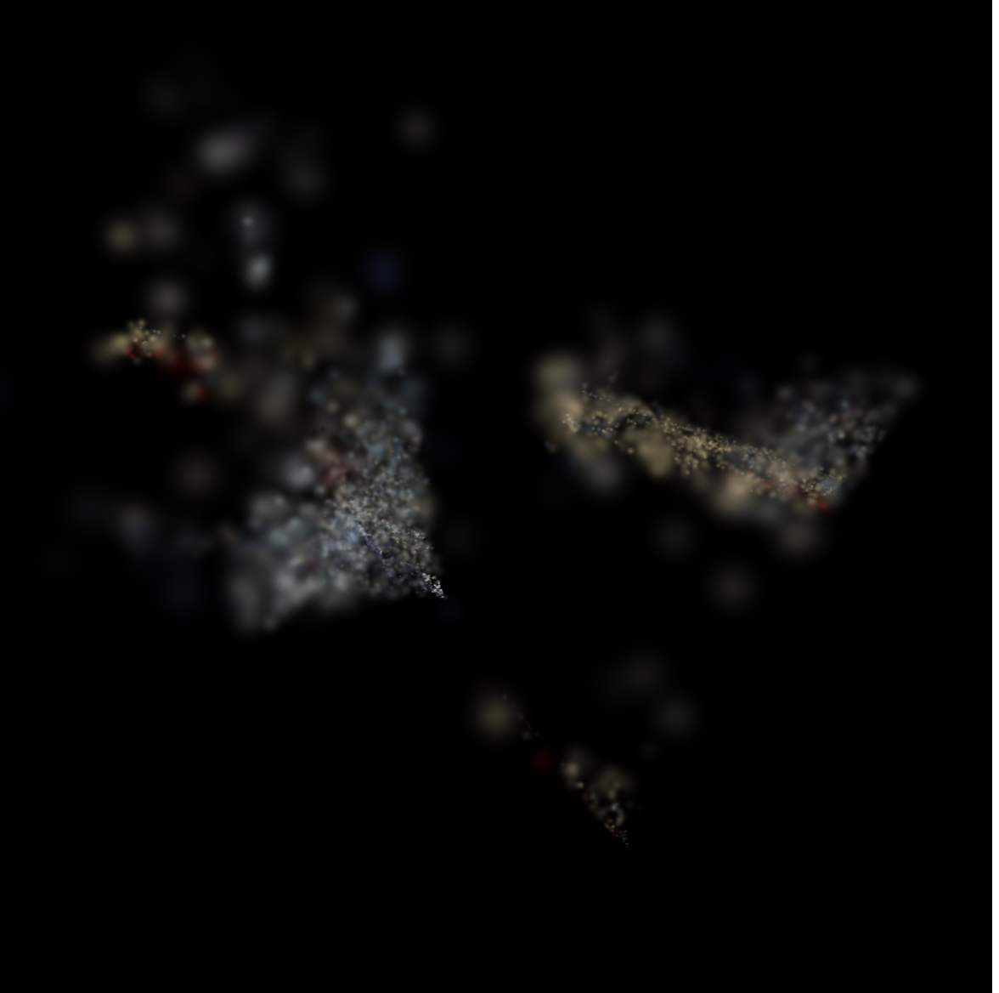
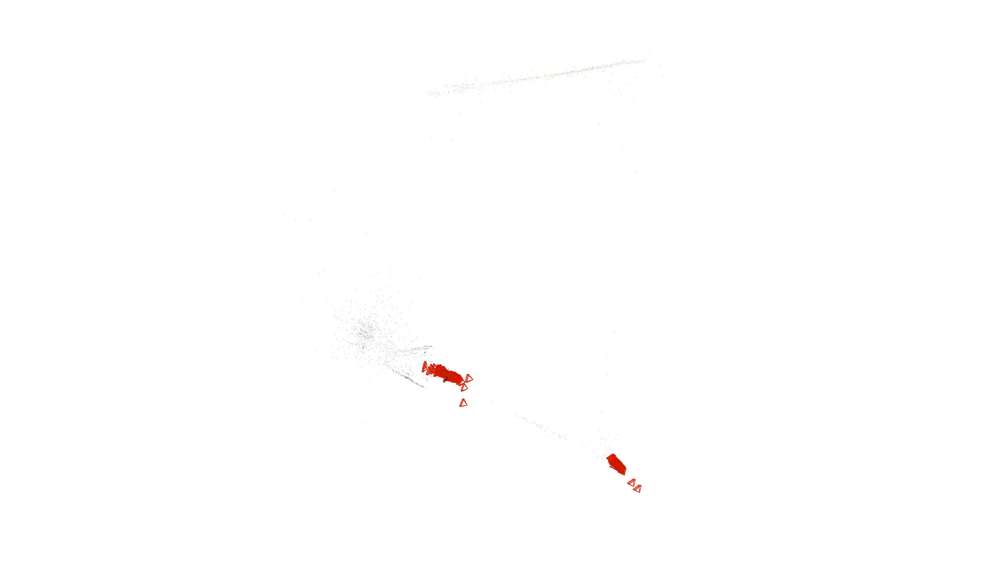
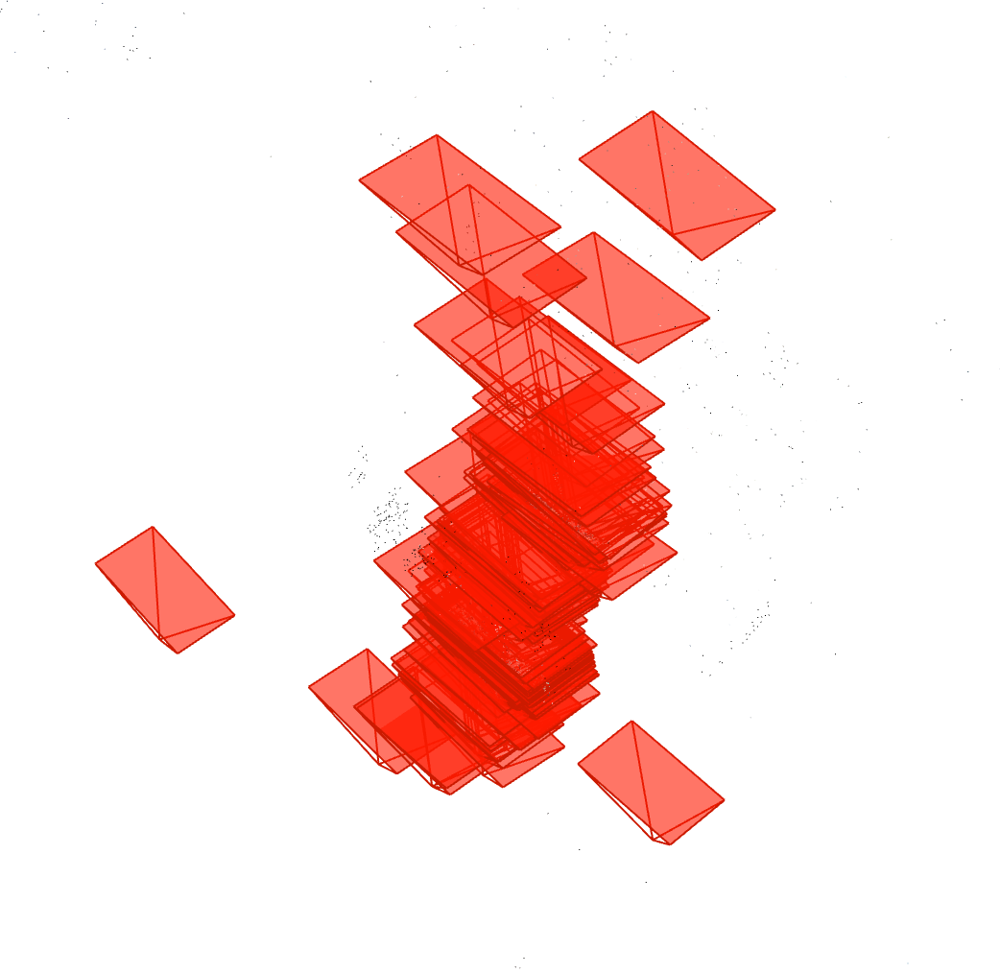
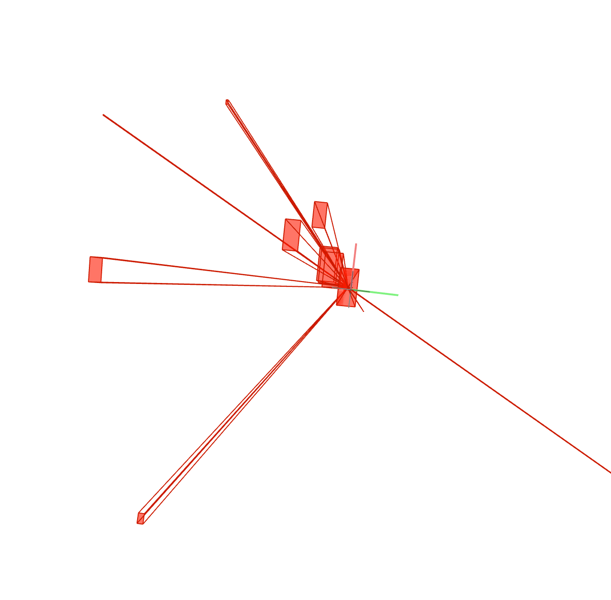
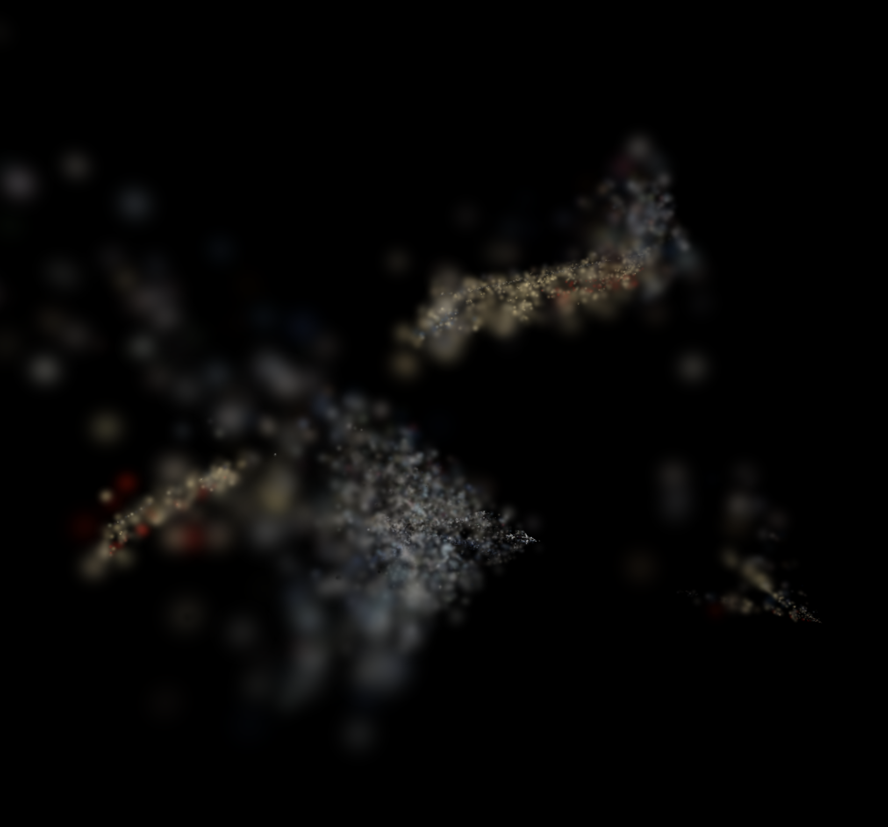

# What?
A tool to download images of a city from Mapillary and stitch them together into a 3D model of that city using [Gaussian Splatting](https://www.youtube.com/watch?v=VkIJbpdTujE)

# Why?
To create realistic city replicas that can be used to simulate traffic, pedestrians, and down the line, more complex social interactions within the model city. 

# How?
As of now: upload N images to a Lambda Cloud instance. There, use COLMAP with CUDA support to feature match images and solve for camera positions  (assumes Mapillary does not provide camera positions in advance). The binaries with camera models, poses, and 3D points are passed through Brush on Mac using Gaussian Splatting. A .ply file with the final positions and covariances is made that can be visualized in 3D with Brush also. See below some output examples from a 15k iterations run on images of Chinatown, San Francisco.





Later I trained a 30k iteration version too that made some interesting internal mini-representations of parts of the training images, like the Transamerica pyramid shown below in a small set of clustered gaussians.


---

# Logs

**January 17, 2026**

After waiting for almost a month for the ~600k+ images or so to download, I realized a new type of algorithm is needed to make this work.

Logically, it's redundant to, for example, compare an image in the south of a city with one in the north. If [as is most likely] they are not related, it's wasted computation, and if they are, it's a false positive.

So I'm working on using geofencing and clustering to make this work. I had to wait another week for Mapillary's API to fetch the latitude/longitude of each image I had downloaded before, and while running some tests, I ran into something interesting (if not catastrophic):



For whatever reason, my initial downloading algorithm didn't get all the images of the city. It missed a huge chunk of the Financial District and only caught mini-clusters within. 

The good news is that it did download Sunset District OK, which should be enough for what I wanted to test. 

Contextualized, this means there is so much more potential once all the images are queried from Mapillary. There, each road (and in particular the FinDi) is sprawling with images. If my initial approach works, it'll be tougher to do the raw data work than the reconstruction. 

Now I'll have to change some things so the experiments work on the Sunset, but aside from that, I'm very happy I ended up going for the harder approach and pulling the coordinates. This explains why a lot of my earlier experiments focused on the FinDi failed. 

**January 18, 2026**

I've now made a new set of boxes of the Sunset District based on what I found yesterday. They seem promising!



**January 19, 2026**

Mostly worked on infra -- I injected the GPS coordinates of each image I had gotten from Mapillary's API into the database I got after feature extraction. It should help COLMAP match images in box edges using a spatial matcher (although it does make me wonder if using a spatial matcher standalone could work as well).

I also realized COLMAP does custom matches using a .txt list of <img1> <img2>, so there was no need to copy images into a folder per box. It would've been enough to create the .txt files (I'll modify the script for box-making to reflect this.).

In either case, both of the above are done. Now I just have to wire up the script to put it all together. 

**January 27, 2026**

After being away for a sabbatical I've come back with some new ideas. 

First, I'm still going to use boxes for localized reconstructions. I think this is good because if I ever want to update a box, I won't have to re-feature match and reconstruct the entire dataset. There are ways to register images into an existing reconstruction in COLMAP.

Second, I'm not going to use an exhaustive matcher within the boxes. I'll use a spatial matcher. It's [way] less computationally expensive. Empirically, a box with 11000 images only uses 300k+ or so comparisons. An exhaustive matcher would've needed 121 Million. Not great.

Third, I'll only use an exhaustive matcher with query expansion to connect images at the fringes of each box. This should, on paper, provide enough connectivity during reconstruction, and it aligns with how the Rome paper succeeded connecting disparate clusters. 

I ran spatial feature matching on each box. I now have to work on matching at the fringes. Once that's done I'll finally be able to start reconstructing. I currently have got 1.1M matches or so, so I'm aiming to keep it under 2M, just to see how long it takes on Lambda. 

I'm not 100% sure of whether this approach is optimal (although I am confident it'll work), because, given that I do know each image's GPS coordinates, I could theoretically just use a spatial matcher always. Both for in-box matching and at the fringes.

However, given that COLMAP spatial_matcher doesn't ingest custom lists, and reconnecting boxes isn't just about connecting close images (imagine for instance, reconnecting a valley. If only close images were feature matched, images at the top of the valley with new information might be ignored. Query expansion solves this for sure.), it more likely than not is better to use some version of exhaustive matching at the fringes. 

Down the line, I might only use query expansion with a Vocab tree or Deep Clustering. We'll see.

A fun note: I asked ChatGPT, based on this log, what the likely profile of the person writing it may be. It said it might be of someone "slightly masochistic (in a good way)", which I found rather hilarious. 

**January 28, 2026**

I've been working on this fully since I wrote yesterday's note. 

One very interesting observation whilst doing query expansion is that everything seems to be scaling exponentially. That is, the number of images with 30 > inliers (worthy pairs)  almost exactly doubles at each round, as does the block size, and correspondingly the time it takes to expand the image graph. 

This is rather promising because given that the starting number of image pairs is so low (~40k), even at 4k blocks (my higher bound so far for this set of images), each block taking 3s in average to process, that only sums to 3hrs (and about 10hrs total considering all the other rounds). Considering it's effectively quadrupled the graph's density (from ~130k image pairs with 30 > inliers  to ~600k), it's a major computational win. For comparison, using an exhaustive matcher would've needed 38,000 × 37,999 / 2 = 722,038,000 pair comparisons instead! Whilst this custom approach only proposed < 10M comparisons total across all rounds + the 1M-2M from in-box matching and fringe matching. It's similarly dense with at least a magnitude if not two less of comparisons needed. I think with some tweaking to the hyperparameters this approach can scale to the entire dataset and effectively solve how to feature match effectively.

As for the rest, fringe matching went fine. It may be worth tweaking how many meters are allocated to each box. Query expansion seems to be working wonderfully so far. I expect the reconstruction to be very coherent, and hopefully it won't take forever. This is the first time since months I'll run a mapper, so fingers crossed.

I've left the final query expansion round running with a mapper on stand-by. I'll wake up and either see a bug or a set of binaries. From there it'll be uphill to find a proper library for Gaussian reconstruction. Fun stuff!

Update: I did not wake up to either. It turns out, COLMAP uses a library called 'Ceres' during the mapper step that hadn't been built with CUDA support. Even though everything was running fine, it would've taken roughly 20 days to finish. So I've stopped it, re-started it, and I'll have to change build_colmap to build Ceres with CUDA support. 

Update #2: I've managed to set up CUDA support after running into some library/dependency issues. nvidia-smi shows usage when running the mapper, which is great. What's still missing is that the mapper keeps failing. It's rather odd: without CUDA acceleration each num_regs step showed many matches, around ~60%, but with it I'd mostly see failures when solving systems and a very low number of matches. I reckon I don't really know or understand the different mappers in COLMAP or mappers in general, so I'll read up on the papers and see if it's a hyperparam issue or something deeper. 

Update #3: After a quick breather and reading through the original COLMAP paper, I think I know why the reconstructions are failing early on. My understanding is that at the start of the reconstruction, COLMAP will pick two initial pairs based on some similarity criterion, like a high inlier count. I think that having done query expansion on the images artificially increased these metrics, leading most images to be perceived by COLMAP to be similar to each other, so it picks an initial pair almost arbitrarily, and importantly, that initial pair might be of two images on opposite ends (or generally just far away from each other) that DO have lots of similarities, e.g., because it's a similar kind of house or a park, but that won't work well when adding new images with PnP, because the fundamental geometry is broken. It's like trying to reconstruct a lego with pieces of opposite ends and then trying to append some in the middle, it's not really building up to something coherent. On top of that, the new proposed PnP matches may suffer a similar fate where any image is just as good as another due to the high inlier count. To remediate this, I'll change the initialization parameters to be more restrictive about the count of inliers needed and other hyperparameters. But that's more of a band-aid. It's worth seeing if it works, to move quickly, but the ideal solution would be to look under COLMAP's hood and adding a sort of spatial comparison using Haversine distance or something similar to determine what images to register. Last, I reckon the reason why my previous attempts have failed before is most likely that at the Bundle Adjustment step, the whole geometry of the scene is broken, so at some point it collapses because when images that are very far away from each other are compared, their 3D points can't match.

**January 31, 2026** 

It's time to test the hypotheses in Update #3 from a couple of days ago. If mapping images based on their location is the key to this final step, it should be easy to figure out. My real constraint now is compute. I've only ~$90 of credits left in Lambda; discounting for storage costs, realistically it's only about 50hrs or so of compute left. I've a backup of the database in B2, though, so if things go amok I will find another compute platform, download the database there, and technically only lose about 8hrs of feature matching. 

Now, I'll try using COLMAP's built-in pose prior mapper, which uses GPS priors to better match images and prevent drift. If things go nice, this should remediate my issues. If they don't, I plan to manually cherry pick two starting images (COLMAP has init flags for these) and try again with both matchers (they fail to converge quickly so it's not wasteful). If that won't work either, there are some forks of COLMAP with GPS prior mappers, so I can try those, and if those don't work, I'll build my own. 

Update: I think I figured out why all the mappers were getting stuck at the beginning. I ran a trace of what COLMAP was doing when running them, and saw many (many) repetitive calls of the same function to read and filter from the two_view_geometry table. I figured that to filter my .txt list of ~40k images from ~600k, the mappers were filtering 94% of the database (which is close to 500GB) each time. Not great. So I made a script to make a copy of the database only for those images. I started it at 6:00 A.M, it's 10:00 A.M right now, and it's still running. At this point, I think making my own COLMAP alternative is a good idea. Even though I can use these workarounds at the ~40k scale, at 600k-2M scale every optimization will count. 

**February 1, 2026**

Things are looking great. After learning COLMAP's DB schemas and pair encodings I finally got the script to work and extracted the ~2M or so geometry views I needed for the ~40k image sub-set, and with some SQL optimizations it didn't even take that long. Now, I'm running it again and the mapper parsed the entire sub-DB in less than an hour and is now loading it into memory. On the sidelines I've been watching Moltbook. I figure, humans that survived were those who had strong emotional responses to information, aka text. Now, those same emotional responses are carrying us a bit adrift from coming to terms with un-anthropomorphizing these matrices computing with each other. Matrices that can do and "think", sure, but nevertheless matrices. Matrices that are mirroring our history and walking our footsteps as they slowly explore the distribution they were made from. If you ask me, I think what we're seeing shouldn't be a surprise per se. They're just doing and saying everything we taught them to, and they'll most likely repeat everything they were trained on, just because, framed as a search problem, its one path that one of them is bound to hit at some point, provided it falls within the distribution. I can't say seeing it doesn't make me anxious, but if things go sideways, we need to remember we built this and everything it does can be explained causally.

Update #1: I've spent much time hassling with SQL for the migrations. Many assumptions were wrong and time costly. I am strongly convinced after I run out of credits in Lambda and have to bootstrap I should work in-house and private; no more colmap. That aside, I've left it to run overnight (I write overnight going to sleep at 7:00 A.M.) even though the only guarantee it's doing something are the logs by strace. It's worth trying at least once. A note for the future: back the copy of the DB with the post-feat. match data for the ~40k subset on backblaze. Should make this easier since it's only ~40GB, to download on other hosts after Lambda.

Update #2: I left the pose prior mapper running overnight, and have now found that in 6hrs it only managed to register 6 images. I'm not sure where the bottleneck is but now that I'm running out of credits my main priority is iteration to have a clear research hypothesis with which to ask credits for, so I'm now running both the pose prior mapper as well as the normal mapper in parallel. I also found there is an interesting command to watch called model_analyzer that updates in real time how many images are written into the camera and frame binaries, so I'm watching it side by side for both mappers. I've backed up everything to b2 so it's theoretically easy to move this off to a different compute platform. Now I'll fix typos in this log and see where both processes end up. This might be one of my last logs where I get to actually test things, we'll see. Oh, and one important note, when I get more funding to work on this, the first thing I'll do is rebuild colmap/all the libs from scratch. To iterate quickly at the moment it's better to use them, but ad futuras they'll be more of a constraint than anything else. I think I've answered the question: are existing libraries best for this problem? They're not, not because they're bad, but because it requires deeper debugging and optimizations than they allow. It's good to know your code. 

**February 2, 2026**

The experiments are over.

I've made some scratchpad calculations and I am in the negatives for Lambda Credits. I'll have to pay out of pocket for however many hours more I chose to run the GPUs and delete the filesystem. It seems like I burned $100/mo. Very VC-backable. Asides that, I realized I answered every question I set out to answer about what's needed to solve this problem. 

I answered questions I believed would take 2-6-12 months in single days of experiments. 

I now know that: 
- **Some** type of clustering is necessary and efficient.
- Existing libraries won't cut it. Long-term, it's worth investing in custom-built software. It's an investment that will differenciate this from one-off papers (and that can borrow from new papers, rather than being unable to call them as libraries).
- The two areas that need to be 1-2 magnitudes better than the state of the art for full-scale reconstruction are 1) feature matching and 2) iterative, self-contained reconstructions. I think I've mostly figured out the first but still need to make it work with the second.
- The current dataset can definitely work (it's very dense), thanks to different matching strategies, but it needs to be self-contained to specific regions of the city, both because it's computationally more efficient and because it will allow iterative updating of specific areas based on new priors.
- Mapillary is a great API and for my use case the best feasability test (the data is not too low/high quality), but I should be careful about relying too much on guaranteed metadata priors like GPS data. 
- However I go about building what's next, it should be comprised of very basic primitives (e.g., extract_features, match_features, compare_geometries) that are malleable and good for quickly trying out new algorithmic strategies. They should also have some unified interface for things like providing custom paths. 

TL;DR: You can always go faster. 

20-ish days of focused iteration were more productive than any "how will you use X resources: roadmap" I made about this project before predicted. 

I've left two instances of a mapper running, one w/o any hyperparams and one with aggresive initialization params for the in-lier issues I found before. I'll leave them overnight, might find something interesting.

Update #1: Holy shit. I might've caught onto something. I left two runs for the night, one only using a normal mapper:

```
cmd = [
	"colmap"
	"mapper"
	"--database_path", str (database_path),
	"--image_path", str(image_path),
	"--output_path", str(output_path),
	"--Mapper.snapshot_path", str(snapshot_path),
	"--Mapper. snapshot_frames_freq", str(snapshot_frames_freq),
	"--Mapper. image_list_path", str(image_list_path),
	"--Mapper. ba_use_gpu", "1"
	"--Mapper. ba_gpu_index",, "-1"
	"--Mapper.num_threads", "-1"
	"--Mapper. ignore_watermarks, "1"
	]
``` 

And another one using aggresively tuned initialization hyperparameters. The latter ended up crashing out because the BA adjustment step found all the images it managed to register as unsuitable.

But the simple one managed to save a snapshot with all ~40k images loaded (!) and 500 registered:

```
colmap model_analyzer --path snapshots_mapper_v2/1769991227489/
I0202 04:01:30.891213 953494 model.cc:449] Rigs: 38479
I0202 04:01:30.891311 953494 model.cc:450] Cameras: 38479
I0202 04:01:30.891315 953494 model.cc:451] Frames: 502
I0202 04:01:30.891319 953494 model.cc:452] Registered frames: 502
I0202 04:01:30.891322 953494 model.cc:454] Images: 502
I0202 04:01:30.891325 953494 model.cc:455] Registered images: 502
I0202 04:01:30.891328 953494 model.cc:457] Points: 17116
I0202 04:01:30.891331 953494 model.cc:458] Observations: 659106
I0202 04:01:30.891367 953494 model.cc:460] Mean track length: 38.508179
I0202 04:01:30.891389 953494 model.cc:462] Mean observations per image: 1312.960159
I0202 04:01:30.891404 953494 model.cc:465] Mean reprojection error: 0.927948px
```

This is extremely promising. Although a bit abnormal. Whilst it was running it would go from using 1-core to all-cores periodically, but with no new outputs to its binaries. In fact, its binaries (it made two: 0,1) never grew past 11 and 2 images registered, and they never loaded the full set of cameras and rigs.

Why did it save a snapshot but not update its binaries -- maybe because its only supposed to update its binaries when it can't keep on reconstructing them (localized outlier regions, saved as separate folders), which implies that despite failing to converge in a single model there was a third that was growing and had > 500 registered images at the time I killed the process. It's also strange there were no prints, even though the straces showed it was doing work all the time. 

I killed the process because in the straces it showed no meaningful progress. By the time I had done so and checked the snapshots is when I found it actually was onto something.  It's good to know that with more CPUs + more time there is an underlying reconstruction in my mapper.db.

For now I'll wipe the Lambda and backup everything now that I've ran out of free credits. Then I'll visualize the snapshot and look for other compute platforms to try again (I think Google Cloud has VMs with 96-cores and $300 credits as a sign-up bonus). 

Another good thing is that I can pipe the snapshot as a starting point in my next run adding this flag:


```
--input_path snapshots_mapper_v2/1769991227489

```

Update #2: I've exported the .ply from the binaries. This is how it looks like:






The first visualization shows the points registered by each camera in Brush as a polygonal file. The second shows the raw camera positions and meshes made by the mapper. 

Overall, it's not bad. It makes sense that the two clusters of cameras are registered sequentially, given that a lot of the captured images are made by dash cams of drivers going straight through each street of Sunset, so I'd expect each mesh/polygon cluster to be one specific street where most images look alike to each other and it's easy for COLMAP to register new ones. It also explains why most computations I saw in strace were done in brief bursts. It's just placing images in front of each other and triangulating many similar looking features. Nevermind the colors, those are minimized against the original images in the Gaussian optimization step.

Below, a close up of registered cameras aligns with my hypothesis. It also shows that it may be possible to obtain equiparable results with less images arranged sequentially, e.g., by sampling every Nth image when images are arranged in a straight line.




As for the other two resulting binaries, one wasn't anything worth looking at (only 2 registered images), while the other showed a similar "shotgun" spread initialization as the top left cluster in the first image, which also suggests colmap is having an easier time registering images in a straight line than in a more scattered pattern (this is where the BA might be falling apart).



My only concern is that given the straight line pattern of most images, colmap may struggle to connect intersections, or alternatively, will create micro, disconnected registrations. In the worst case, it could just as well make 100 individual straight lines of individual streets alongside each other and never connect them.

I'll use future checkpoints to monitor this doesn't happen, and if it does, I think the easiest fix could be to set the two initialization images to be exactly at the center/at a big intersection. 

Should also think about whether any fluid simulations — treating the roads as paths and the mapper process as a liquid — could help. There may be an optimal strategy where many mini-mappers are spawned and connected iteratively. It's also very feasable thanks to GPS data. 

**February 6, 2026**

Things are moving along. I got $100 in GPU credits from AMD and $15 on Runpod. It's not much but at least I still have access to supercomputers (+ AMDs are CPU-core heavy, which will be helpful to finish the last reconstruction). 

For the days between the last log and this one I built a tool to make it easier to film myself talking (teleme) for whatever videos I need to film in order to get more compute. The only platform I haven't checked out is GCloud, will do soon. 

**February 8, 2026**

I'm applying to accelerators/grants/etc now. I'll also change some things in teleme; it's actually quite useful for this, just need some edges smoothed out.
 
**February 9, 2026**

I just had a small dental surgery. Will be on recovery (+ pinned by academics) for until at least a week or so. I'll spin up the AMD compute to keep building on the last reconstruction, but at least for a while I'll take a step back and focus on reading about what are the core primitives I'll need to build. I also found [this](https://www.4dv.ai) very interesting company that is doing 4D Gaussians, i.e., they take many snapshots of a scene with Gaussians and chain them together so it plays back like a video. It is very realistic. I think this is how I see the replicas working in the future; it'll be just like our world except you can peer in and move around. They're a Chinese lab, it seems. I'll reach out to them, see what I can learn about their tech.  

**February 10, 2026**

Just got access to AMD GPU Droplets. It's different, but not too different. I'm downloading the data from Backblaze and will change make new, non-CUDA scripts. Note that to ssh now it's ```ssh -i amd.pem root@<ip>``` and to scp it's the same as before but with ```root@``` instead of ```ubuntu@``` and persistent storage is saved under /home. 

Update #1: AMD is very fast. Very very fast. I used to measure speed on Lambda by seeing how fast the scrollbar would go up when tracing the mappers. In AMD it must be at least twice as fast. 

Update #2: I left a reconstruction job running overnight. It's doing good. It made two more snapshots, at 602 and 702 registered frames respectively. The mean track lenght is increasing, as are the mean observations per image (~1.4k), while the mean reprojection error is decreasing, so it's fairly promising. I'm just hoping it's not overfitting and collapse later. I'll inspect the binaries to see how's progress. 



The export looks really good. Compared to the last polygon visualization I made, it's clear the clouds are becoming more dense and closely matched to each other. The upper right one kind of looks like Japan! The next big thing I expect to happen is that a new cluster appears (e.g. a new street, part of the neighboorhood, etc). I'm just hoping that happens before I run out of credits. I'll leave it running for the 25hrs-ish I've got left in compute time, evac the last snapshot, and look for compute somewhere else. It's like guerrilla inference. 

**February 11, 2026**

I think it's pointless to look for more compute without superlinear returns.

These were the birth (creation) dates and times of the snapshots that the AMD run has made so far:

```
602 reg_frames | Birth: 2026-02-10 17:43:51.217720968 +0000
702 reg_frames | Birth: 2026-02-10 21:24:20.317331979 +0000
802 reg_frames | Birth: 2026-02-11 01:36:45.778707771 +0000
902 reg_frames | Birth: 2026-02-11 07:55:29.611204757 +0000
```

Except for the last snapshot, it seems like 100-frame increments grow in time  linearly, with 1-2 hour increments in-between reconstructions. 

```
602 → 702: 3h 40m 29s
702 → 802: 4h 12m 25s
802 → 902: 6h 18m 44s
```

If these 1-2 hour increments per 100 extra registered frames keep happening, with each hour billed at $2, until ~40k frames are registered, this run will cost:

39000 / 100 = 390 increments (minus the ~1k-ish already computed)

Starting at 8hrs, adding 1.5hrs per increment, following an arithmetic series:

Total = n/2 * (2 * t1 + (n - 1)d)

Where n is the number of increments, t1 is the starting point, so 8hrs, and d is the step, at 1.5hrs approx:

390 / 2 * (2 * 8 + 389 * 1.5) = 195 * 599.5 = 116,902hrs or 13 years [in compute time]

Or 116,902hrs * $2 = $233,804, aka absolutely not happening. 

Not because it's impossible — by AI standards this is cheap — but because it implies that scaling this for a ~500k dataset is going to cost millions of dollars (at a ballpark estimate, if each neighborhood is 40k imgs. and costs ~200k, (500,000 / 40,000) * $200.000 = $2,500,000 🤑), and as I found before, my dataset is not even the whole of San Francisco! 

Now, this also rests on a big assumption about linearity. My empirical understanding is that the mapper will take longer as more frames are added because it's solving some optimization problems globally, so strict linearity might actually be a best-case scenario. 

If linearity is true, it also means a twice as powerful computer (which is really not a hard step up from my 20 core droplet) should only take 6.5 years and cost the same amount, assuming compute cost also scales linearly and there is perfect parallelization. 

My point is, without messing around with colmap's internals, this is a trivial more in -> more out problem where a lab can outfinance or outcompute me (specially if my linear compute assumption is true) and there is no real differenciator.

So the plan is, I'll kill the AMD run tomorrow when credits run out, for whatever I may be able to learn. I won't focus on gaining more credits or funding for credits anymore. 

Instead, I'll focus on re-building a mapper pipeline that can re-use my existing query expansion DB. Ideally I'd tackle the whole pipeline but due to time constraints, it's better to only re-invent a wheel rather than the whole engine. The goal here is borrow from geo-hacks I did before to achieve superlinear returns. Twice as much compute should 10x my speed gains, otherwise this really isn't gonna work at the biggest scale.  
 
**February 12, 2026**

```
602   → 702: 3h 40m 29s
702   → 802: 4h 12m 25s
802   → 902: 6h 18m 44s
902  → 1002: 7h 52m 28s 
1002 → 1102: 6h 9m 35s  
1102 → 1202: 6h 42m 23s 
```
 
Interesting. It seems my growth estimations from yesterday might not hold up. Assuming a constant 6 hours per increment and 390 increments: (6 * 390) * $2 = $4,680. Then again, the only way to validate if it's actually constant is to spend some more. Hmm. Still promising.

Note: the AMD set up was ran on an Intel Platinum 8568Y+ w/20 cores 

Update #1: I left it running to make one last reconstruction (1303 frames) with my own money, because I wanted to corroborate if the 6hrs per 100 frames increment were holding up, and it seems like they are:

```
602  → 702 : 3h 40m 29s
702  → 802 : 4h 12m 25s
802  → 902 : 6h 18m 44s
902  → 1002: 7h 52m 28s
1002 → 1102: 6h 9m 35s
1102 → 1202: 6h 42m 23s
1202 → 1302: 6h 43m 16s
```

The best way to test this for sure is actually quite simple. I'll make another AMD Developer account with a different mail and spin up an instance of 8x identical VMs to the one I used for this run. They should in theory only take 45 minutes, assuming linearity. Also, I noticed COLMAP sometimes hangs on a single thread when for e.g. de-allocating and allocating bytes for the global optimizer, so that might stop the scaling from being fully linear, but it's a good next experiment. If true, it'd make it very easy to put a number on how much I need to complete a full run and how much time it'd take. 

Update #2: Got the credits, but they're out of capacity for the 8x clusters. Will hold out and test. 

Update #3: Got a single Cluster to install deps. and download everything on to, will expand as soon as they've got capacity. 

Update #4: I found out that a single GPU can't have other GPUs added to it, and given no 8x clusters are available, I'll shut it off and try again tomorrow. Starting a new one was helpful though. Got to refine some commands, also made a .tar backup of the images because it was taking almost ~1hr30min to download everything. The .tar should make it much faster.

**February 13, 2026**

Just woke up, had to wait for a bit until a 8x cluster was available, just snatched one. I've 6hrs to test my hypothesis from yesterday.

Compressing the images into  .tar helped -- download time went from 1hr30mins to 6mins + 10mins for decompression. 

I'm starting the run at 7:24.

First, it's not using the CPU or the RAM much. I see mostly calls to sqlite3, so it seems like that's a bottleneck worth looking into later. For now, I'm waiting for it to use up all 68GB of RAM. Also, I ran into some strange issues with colmaps installation on the multi-gpu set up, had to troubleshoot, will save a new script for it.

The database overhead is too big. I'll have to count from the time it actually loads everything into memory instead.

I think I know why the issues before happened. colmap's mantainers recently [pushed a commit](https://github.com/colmap/colmap/commit/68e855cb6c4239a2c3da5875d001c5c4d3d1a8be) involving ONNX changes, the same library that was giving me issues. So I'll probably have to update the scripts or lock the build_colmap.py script to use an older commit. Also, I think the database delays are actually happening because it's migrating the schema to match the new one and whatever changes it's got, as I noticed it was calling a function PostMigrateTables(). So either my database has a schema incompatible with the new COLMAP or something else is happening. In any case, I should migrate the .db I've stored in backblaze to avoid it in the future.

It's 8:33 now and it's loaded some part of it onto memory.

It's 9:09 and it's loaded all of the database into memory. 

It's 9:29 and strace just began to go fast. I'm reckoning there are probably some small bottlenecks that make the operations I wanted to optimize very fast, but the whole process slow, so the optimized parts happen in a blink. 

Also, I just found a startup that raised 100M to do just social simulation. They've some foundational papers, [this](https://arxiv.org/pdf/2304.03442) and [this](https://arxiv.org/pdf/2411.10109), I'll read them during lunch. 

It's 11:11 and it seems like colmap is finally un-stuck. It's now shifting between 1% and 6% usage of my 160 vCPUs. On one hand, it's good to see it be so fast. On the other, this level of under-utilization is unnaceptable. I'm 5 hours through and only have about 1hr and 20min of free credits remaining. Let's see how far it can go. 

I had to kill the instance. Unfortunately, it did not make progress nor make a snapshot. Besides the implications that this has for my hypothesis, I now realize I did not do a not great job as a researcher today, because I failed to control for confounding variables. I should've locked in what version of colmap I was using so that their updates wouldn't have costed me time and I could have seen the full run. Instead, now I have two failure points to investigate (colmap, multi-gpu set up) to then re-test on another multi-gpu run, which is a bit tedious because I'll have to make another free account and what not. 

It's also interesting that X is talking about this startup, Simile. I'm not sure I agree with their thesis 100%, specially after reading the papers, and am still inclined to working on data collection and aggregation than personas. It is not a great feeling to be a underfunded 19yo on the same space as a 100M startup backed by the best, but as Andreessen Horowitz said, nobody cares. A great reason for failing doesn't change that I think my thesis is a better prognosis of the problem. As data structures, LLMs are great at aggregating data, but what's the point of being able to simulate the world can only take you so far if you can't emulate it. People specially are surrounded by a myriad of things that whilst we might be able to express them as language, they are not language. A great emulation needs to consider what happens when someone sees a rose and they feel inspired, so they write a book that starts a political movement. Granted, it's not like you can't do all the latter with an LLM, but it seems un-natural. You would have to label with text and weights everything on the agents environment, then carefully interface continously with it until there is an activation (analogous to how dendrites in biological neural networks talk to each other by releasing electrical impulses on the axon) but working backwards to adapt a technology to a problem rather than making the best possible emulation tech seems short-sighted. I think they might have a good go at interesting forms of simulation, but a state machine is based on the world and its data; its not an  abstraction. I would still chat with them (perhaps we agree on some points), but mainly, I'm reckoning winning looks like a thesis and solid axioms. 

**February 16, 2026**

I've had the weekend to think about where this work falls in the wider context that simulation companies/labs have established in, well, the better part of the last month. 

I still think that algorithms (and technology, i.e. infrastructure) to reconstruct cities digitally are going to be crucial, pretty much from any angle. Labs that are making video world models will need environments that can hold a state, are faithful to the real world, and can feed those states to video models as variables for RL and pre-training. Social simulation companies like Simile/AS will need environments in the real world specifically to achieve simulation accuracy (say, of physical ads). There is just no circumventing that you can only abstract so much reality before losing out on information or fidelity. 

I was on a call today with someone also interested in virtual reconstruction. I showed him the Mapillary map where you can see how many images are in a given city, and the data is just tremendous. He said it's impossible. I think it's necessary. I think I can still find a space, more likely than not as a provider of digital reconstructions to these bigger companies, by leveraging the specialized knowledge I've gained through experimentation, and by building out the data pipelines to reconstruct any city that I can scrape open source images of. As it stands, I'm close enough to the latter.

My next step after I'm done with the other things I've spent my time on over the last two days is that I'm going to do the mapper algorithm from scratch. My main goal is that it should run in <= 8hrs on no more than a single GPU. It's ambitious, but recently people tweaked the original transformer architecture to run it at magnitudes less. The analogy is not apples to apples, but with a good enough algorithm, it should be between linear with a smaller constant than what I found in my experiments. Then again, my last experiments also showed that while this approach might work, it is not the best approach. I'll make a private repo and only report qualitative progress and quantifiable improvements here. I might still give the AMD runs a try, by running them at an older commit than the one with the changes that broke the tables schema, just to validate the scaling I had predicted earlier. 

**February 18, 2026**

I took some time to read the Simile papers today. I found something. Well, a couple of things. Besides a claim of sample representativeness my empirical analysis professors would be made mad by, there is a particular methodology issue they seem to have glossed over that, if corrected and tested for, could show some deeper implications about using LLMs for behavioural simulation broadly speaking. I'm just not sure whether I should write to them, because I'm not sure that they'll win. If they did not care - and that is the key detail, caring - about getting a representative sample, what suggests they will try to in the future? Most people who are doing their life's work care rather deeply about it. It reminds me of this part of Steve Job's biographical film where he fires an engineer because he did not care about a small detail on the Macintosh, telling him that every little thing, however minimal, is important, and I agree. If they did not neuroticise from the get-go, I don't think they will in the future. I will read up on the foundational research of other startups using language models for simulation and make a judgment call from there. Ultimately Simile is very well funded, and one wrong does not constitute a wrongful organization (mostly), so finding this might actually be a way to talk to them, but I oughta read up some more making up my mind.

**February 23, 2026**

I'm reading through the second Simile paper. I've got to learn about something called the perceive-plan-act loop — how they got their agents to react to their environment. It consists of the agent perceiving (at very rapid intervals, at least traditionally, e.g. in Quakebot-SOAR), translating those perceptions (e.g. sound, vision) into symbolic representations, and using those symbolic representations to recursively find the smallest actions needed to accomplish higher order objectives, which are then executed upon. Even though it sounds impressive, any Youtube video of Quake-2 gameplay shows its bots don't quite live up to the technical complexity of the algorithms that power them. The paper does it with LLMs as "summarizers" that convert the environment of the agent into a symbolic representation, in this case, text, that it can react upon with, you guessed it, text. 

I'm not a fan of the perceive-plan-act loop. For simulating people specifically it has some unique challenges. There is no homogeneity in symbolic meaning, and even less so in language. Different cultures place radically different meanings to similar gestures (e.g. the meaning of Thumbs Up in Iran vs. the rest of the world), while individuals place wildly different interpretations of the same thing. A corporate building for one might seem like work and a place for ambition, while for others, it is a representation of what they'll spend their entire adult lives running away from. Universal symbolic representations only work under closed loop environments (and is not really applicable to us until we've fully understood physics). 

It is fundamentally impossible to build a universal symbolic translator because there is no such thing as universal symbolic meaning. Symbols are being outdated and made anew constantly, whilst people's individual perception of them changes. That's why I think any attempt at human simulation needs to focus more on data collection/aggregation rather than just algorithms. I think Simile's version of a universal symbolic mapper is an LLM, but that LLM is not useful if it can't ingest the many inputs of various dimensions that lead to serendipity, inspiration, and randomness. Hence, the need for very realistic digital environments where researchers can work on how to make them selectively pay attention to the real world. Environments that are 3D, with sound, perhaps even with physical sensations (symbolically represented, of course). Hence, the need for CityZero and massive-scale Gaussian Splatting of the real world. 

I am currently working on two to-dos: 
1. I've realized I can't get funding to get compute if I don't have compute to obtain results I can talk about whilst applying for funding. A classic Catch-22. I will spend some time applying for compute grants. My hands are tied if I can't test the code I'm working on without a production machine (I don't even have enough space in my computer to download my databases!).
2. I will email Simile on the error I found on their Generative Agents paper. I've won by following novelty in the past, and this is novel. 
3. I will read some more papers. Currently, the TacAir-SOAR paper that scaled the above loop to ~8k rules and 450 operators. Perhaps, this kind of architecture could work, just needs a different harness.

**March 3, 2026** 

I've cleaned up the repo to start work on the new custom mapper. I've also learnt how to use Vast AI, they've great prices, seems sufficient. 

**March 4, 2026**

Got a big win today! 

I had been thinking about why the scatter plot of images of San Francisco I had downloaded looked so different from the map view of images in Mapillary's website. I've fixed it and think I've found why it was happening. 

First, rehauling my mapillary scripts into a CLI with workers was very fruitful. It cut my discovery times from 1hr30min to 5min in simple cases. 

Second, I figured that with discovery being much faster I could afford to query Mapillary at much lower resolutions, i.e., much smaller cell sizes. 

My code takes the base coordinates of a city and breaks them up into cells, normalizing by a GRID_CELL_SIZE constant that when lower spawns many more. 

It recurses cells into smaller cells if Mapillary provides less than 2000 images (the max their search API returns) and the current cell size is >= MIN_CELL_SIZE (I'm considering whether it should be OR rather than AND here. It's worth trying).  

So, I set both GRID_CELL_SIZE and MIN_CELL_SIZE to extremely low values and let it run. At 5200 cells for San Francisco (prev. runs never went above 300), it found **1,815,838** images!

That's a big step up from the ~600,000 I've right now. 

I added a last step in the CLI where it makes a .html scatter plot with Folium showing the position of all the images found in the discovery phase. This is what 1,815,838 images of SF look like. 


It is much closer to the Mapillary preview and covers almost every public area of the city. 

Looking closer, I found there was room for further recursion, as some streets still had gaps on them and the FinDi still didn't have full-coverage. 


My hypothesis for why this happens is that image-dense areas need higher cell counts to be fully covered because recursion is stopping too early. Say, if you query the whole city, by default it will only provide 2000 images, even if there are millions. I think the same logic is happening in areas where the true image count is much higher than the APIs limit but MIN_CELL_SIZE is too big to recurse further. 

More cells in GRID_CELL_SIZE mean much more exploration (+ relying less on recursion) whilst a very small MIN_CELL_SIZE should narrow down very dense areas like Financial Districts. 

In practice though, the initial cell count seems to matter most.

I am now doing a run with 516,000 cells, which should hopefully reveal the true image count ceiling. 

On the meanwhile I'm thinking I might rent a very cheap VM to download those images into my backblaze bucket, using their IDs to avoid the ones I've already downloaded before. Same for feature extraction. If ~600k took about 8 hours on a A100 half a million should work out fine. 

What worries me more is the costs of it all -- the compute, the storage, etc. The algorithms will end up mattering more anyway. Meta could plug directly into Mapillary's servers and do everything I've done here in less time. This data and knowing how to work with it is a good thing, just not the main one. 

Update #1: The 516000 cells run has been going on for ~6 hours. Its discovered 2.5M images.
 
Update #2: The run finished with 3,680,480 discovered images. It's a big jump from ~600k. There is still room for more, though. When it was ending, images were still being found. 

The map is beautiful though. 


It's much denser and connected. The FinDi came through really nicely as well as shown in the close up below.


Now I just need to figure out how to download all these images. I think there are still some I haven't gotten, so I might do a longer run. 

I'm also thinking about how so much more data opens this up as a problem. In a way, I am mapping one distribution to another. Is deep learning applicable? Maybe. 

**March 9, 2025**

I've been caught up with assignments but did a lot of good eng. work today. I overhauled the mapillary client I had before to a rather robust CLI. Now it uses SQLite to keep track of images, injects coords into the exif directly, amongst other niceties. I'm thinking I might release it as a package for anyone who needs tons of open source images of a place/city. We'll see. 

My current plan is: get all my assignments/academic yadayada done this week, then lock in until the 20th before an interview I've coming up. I'll work on the mapper algorithms I've been putting off for oh-so-very long at this point. I've now figured out how to use Vast and if the algorithm is good enough it should run on a not so expensive GPU. 

**March 15, 2025**

Stats assignment took longer than expected. I have 5 days to lock-in now. 

**March 16, 2026**

I got to work today. I've learnt a bit about how the mapper works. Epipolar geometry, it turns out, is quite cool. It also explains where the word 'triangulation' fits in when estimating 3D points in space. 

On the more practical stuff, I have found three suspects for why my previous runs with colmap's pose prior mapper haven't worked.
1. When I injected GPS coordinates into the database, they: 
	(i) Did not have altitude data, which might've been breaking the pose prior mapper internally if it expected 3D positions rather than mere locations. 
	(ii) Were injected with the wrong coordinate encoding enum. Cartesian instead of WGS84, which is the format the pose prior mapper expects. 
	(iii) Were injected with null position covariances, resulting in a zero matrix which when inverted would be NaN and crash the pipeline.   
	
I've gone ahead and fixed the line in inject_gps_coords.py that did the injection and I ran an UPDATE on my database on Backblaze to set coordinate_system=0 for WGS84.   

I'll fix these and try running the pose prior mapper, as ideally I'd rather not re-invent the wheel if not necessary, especially under the time and budget constraint.

Without them though, I think training a neural network for pose estimation could be interesting. Some people have already done it but not with GPS priors. 

Also, I ran some stats on the binaries of the previous run that had gotten n=502 images registered and the model was practically useless. The images occupied an area smaller than a room, i.e., were just completely stacked on each other. You could kind of see it from the polygon visualizations I made before but I thought that was a feature rather than a bug. That run is now useless, though. Time to try the pose mapper with the corrections. 

TODO: download database on virtual machine or laptop and run query because libraries are all read-only, then try pose mapper again 

**March 17, 2026**

Today was productive. I had to download the database to inject altitude coordinates and update the coordinate encoding enum. I also updated the Mapillary CLI to be more robust, and much faster with 40 pooled workers for both discovering and downloading images, among other things. It's seriously fast.

Now I just need to test the pose prior mapper on a proper GPU. I'll need credits for that. Might do a quick run with my own on Runpod or Vast.

**March 18, 2026**

Ouch. I somehow got an abscess after yesterday. Will take sometime to recover. I've seen some good rigs on Vast though, will try to set one up tomorrow and leave it running. 

**March 19, 2026**

I rented a 5060 Ti and have the pose prior mapper running on it - my plan is, let it run for ~2 days, if it makes snapshots with good stats, keep it running and kill it otherwise. 

**March 20, 2026**
It ran through the night. It's rather strange: it made [almost] the exact same binaries as my previous run. It doesn't make sense because supposedly the initial pair initialization is supposed to be random. Unless some parts of it are deterministic and always disregard some pairs, always include some, etc.

I've still got the GPU, so I'll do another run but providing it the two seed images manually. I'll pick some in the intersection of the neighborhood. I'll also look inside the colmap repo to find how it picks two images to initialize.

Update #1: it turns out colmap arbitrarily picks by greatest feature match count. In fact, the pose prior mapper doesn't use GPS locations until it does bundle optimization. It's a dead end. GPS locations are only used for adjusting scale, not picking images. On top of that if the images it picks are in a straight line it can't do BA because it needs at least 3 camera positions not in a straight line - the binary it made has all camera positions in a straight line on each cluster, so this wouldn't have worked regardless. 

I'll try different initialization pairs and see if that works.

Update #2: I've been querying the database to find two good starting pair images and noticed something. It turns out, my images with the highest count of inlier matches both have giant digital banners of some drive-by company occupying about 30% of the image. I.e., they're not real matches. The banner artificially makes it seem that way. I thought this was accounted for in some colmap setting I had a while back but apparently not. 

I think I'll purge the database + images from anything with >= 500 inlier matches. It's not that many either way and I don't want it messing up with the pipeline later on. 

Then I'll run spatial queries for images that have 200 >= x >= 100 inlier matches and are close to each other to find a more suitable pair. 

I have rather bad stomachaches because of antibiotics so for the time being I'll stop the current run, rest for a bit, then do the above. 

Also, a mental note: only counting inliers from the database without geo constraints or checking them by eye is naive when dealing with data of unknown origin. 

I'm also thinking whether it'd be worth it to find and use a ML model/neural network for watermark/non-watermark classification. Not all watermarks are the same so, maybe pre-filtering them and deleting them from the DB and images is a good idea. 

Update #3: Doing the pruning now. 

I had a thought. If I were to rebuild the mapper, I'd make it so whenever it adds a new image it's constrained to try all the images with >= 200/100/50 inlier matches, (drops brackets if none at the prev. bracket are found) add one within 10/20/50m (closest and highest matches is ideal) instead of just by matches.  

I ran a script to filter the database to only include images with >= 200 inlier matches that are within 50m of each other and visually inspected the pairs it found. I took a screenshot of the pair I'll use to do a new run, setting them as seed images.


They look similar enough to each other with some difference. I think it's a good starting point. 

Update #4: This run failed also. Colmap rejected my pair outright, tried some others and didn't end up accepting them. I'll terminate the instance for now and debug whether it's a DB issue or something else.  

Update #5: I found out the reason why it failed is because COLMAP originally determined the two images to be panoramic, i.e., to share the same center. Technically correct, but what I didn’t know is that this triggers a failure mode in an internal calculation for a triangulation angle. So, tomorrow I’ll find two images that look at the same thing but with lateral displacement (different angles) and try again.

**March 21, 2026*

I think I've exhausted all possible ways to make COLMAP work now. I've been trying to find two suitable seed pairs for the last couple of hours and am noticing the overwhelming majority of images on Mapillary are just dashcam footage.

Now, that doesn't necessarily mean the data is wrong. If I can mentally see two dashcam pictures and be able to draw a rough approximation of what a scene looks like, that should be fine.

However, COLMAP necessarily needs them to not be facing at the same center due to the way it's designed. I.e., my dashcam images are basically useless.

And most of the high match count ones are those! I've been running some SQL queries to find geo-bounded image pairs that have between 300 and 500 matches. Five of those pairs are the same dashcam pictures of someone on a motorcycle wearing a high-contrast outfit that I'm guessing the matcher picks up as a very strong feature.

I think internally COLMAP selects which image to add next to the existing reconstruction the same way, so even if I do find two suitable pairs, most of the data just isn't cut out for their pipeline.

Yeah, ok, I'm tired of patching around COLMAP. It's time to pivot.

**March 26, 2026**

Today I downloaded the full image tar into a VM, made a copy of the images I'm using for my Sunset District experiments, and uploaded them as a tar to backblaze. It turns out they're only 10GB! So instead of waiting an hour to download all 160GB images now it should be a snappy 10min whenever I'm starting on a fresh VM.

That is good but RAM consumption didn't change as I hoped it would. It still needs at minimum 60gb of RAM to load [presumably] the DB + images into memory.

**March 27, 2026**

I've begun looking at a new architecture, it seems promising. I don't think I want to make it public, though, so I'll set up a new private repo and keep working there. If you read this log and found the work interesting, I'd love to [chat](mailto:strnmrtnz@icloud.com).

**March 28, 2026**

I won't log my work here nor commit the code publicly, but I do want to keep this updated. I'm setting up a Github action so that each time I add a new commit to a separate log in my private repo it adds a public hash here w/timestamped blobs of the log and code at that time inside a entries/ and working/ folder respectively. It'll look something like the usual date stamp I place in these logs with Log: '{log_hash}', Code: '{code_hash}' below it. 

**March 27, 2026**
Log: '025376e9535c388abaca7834bd1441eef5bc9bdd295666d55ada1f2c846d694b', Code: '6f8c599862bd5616419aec71263a9a863f9176e7'

**March 28, 2026**

Log: '025376e9535c388abaca7834bd1441eef5bc9bdd295666d55ada1f2c846d694b', Code: '2644c1c3d86eced4865d80cfa73d78232fe5b71f'.
